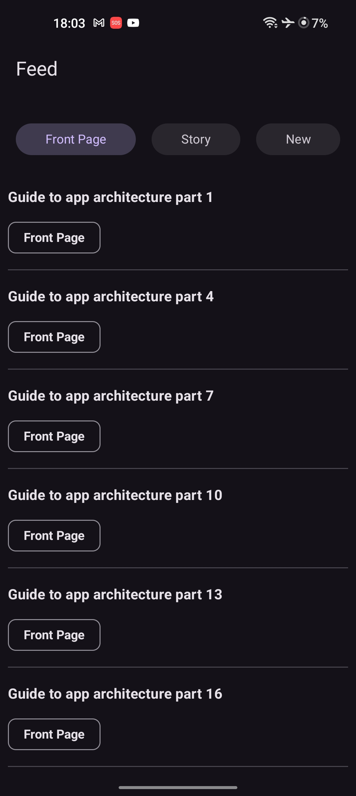

# Android Architecture Basics

Project to exemplify the MVVM architecture used in Android development.

## Structure
```bash
├── core
│   ├── DI.kt
│   └── dispatcher
│       ├── DispatcherProviderImpl.kt
│       └── DispatcherProvider.kt
├── data
│   ├── api
│   │   ├── PostsApiImpl.kt
│   │   └── PostsApi.kt
│   ├── model
│   │   └── Post.kt
│   ├── repository
│   │   ├── PostsRepositoryImpl.kt
│   │   └── PostsRepository.kt
│   └── response
│       └── PostResponse.kt
├── domain
│   └── usecase
│       ├── GetPostsByTagUseCase.kt
│       └── GetPostsUseCase.kt
└── ui
    ├── detail
    │   └── PostDetailFragment.kt
    ├── feed
    │   ├── FeedFragment.kt
    │   ├── FeedUiState.kt
    │   ├── FeedViewModel.kt
    │   └── PostsAdapter.kt
    ├── MainActivity.kt
    └── MainApplication.kt
```

## Screenshots

